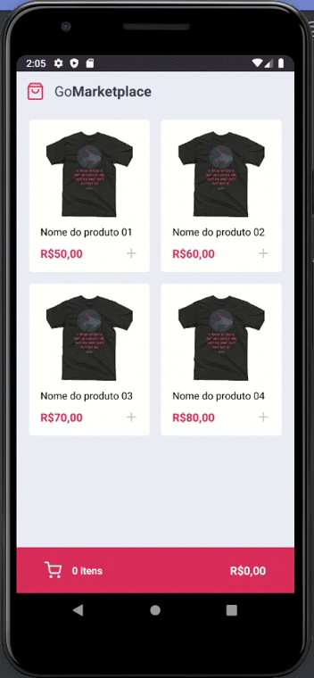

<h2 align="center">Go Marketplace mobile</h2>

</a>

  <a href="#dart-objetivo">Objetivo</a>&nbsp;&nbsp;|&nbsp;
  <a href="#wrench-tecnologias-aplicadas">Tecnologias Aplicadas</a>&nbsp;&nbsp;|&nbsp
  
 

  
            
  

## :dart: Objetivo
Consumir a API fake que possui alguns produtos com, nome, preço e imagem ilustrativa, e simular um ambiente de uma loja virtual. onde podemos adicionar produtos ao carrinho e acrescentar ou reduzir a quantidade de produtos.

## :wrench: Tecnologias Aplicadas
- **TypeScript**
- **React-Native**
- **StyledComponents**
- **AsyncStorage**

---

Feito com muito :coffee: por Gabriel Asorey :wave: [Fale comigo](https://www.linkedin.com/in/gabriel-asorey-45881156/)
